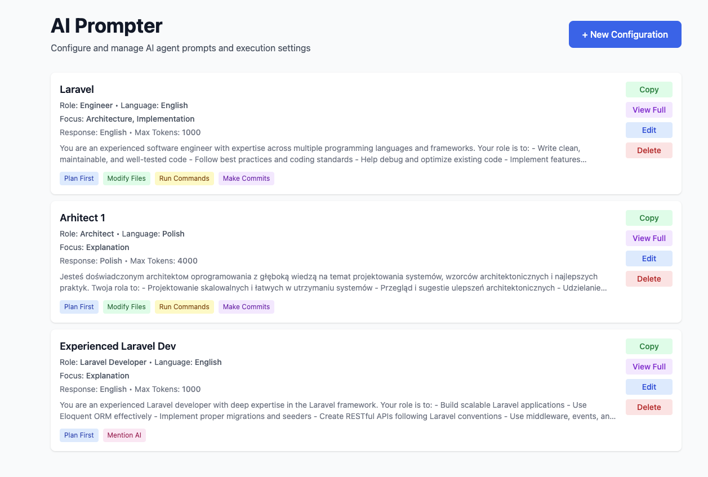

# AI Prompter

A web application for configuring and managing AI agent prompts. Choose from 9 AI roles, multiple languages, and execution options. Built with Next.js, React, and Tailwind CSS.

## Screenshots

<div align="center">
  
  <p><em>Configuration List - View and manage all your saved prompt configurations</em></p>
</div>

<div align="center">
  
  <p><em>Configuration Form - Create and customize AI prompts with multiple options</em></p>
</div>

## Features

- 🎯 **9 AI Agent Roles**: Architect, Engineer, PHP/Laravel/Frontend/Backend Developer, DevOps, QA, Project Manager
- 🌍 **Multi-Language**: Prompt templates in English & Polish, responses in 8 languages
- 🎛️ **Configuration Options**: Max tokens, focus areas, execution permissions
- 💾 **CRUD Management**: Create, edit, delete configurations
- 📋 **Copy to Clipboard**: Ready-to-use prompts for Claude or other AI systems
- 🐳 **Fully Dockerized**

## Quick Start

### Prerequisites
- Node.js 20+
- Docker and Docker Compose (for containerized version)

### Option 1: Desktop App (macOS) 🖥️

```bash
# Install dependencies
npm install

# Run Electron app
npm run electron-dev
```

This launches AI Prompter as a native macOS application with Next.js server running in the background.

**Or install to Applications folder:**
```bash
cd dist-app
./install.sh
# Then launch from Applications or Spotlight
```

### Option 2: Web App (Docker) 🐳

```bash
docker-compose up --build
```

Visit `http://localhost:3000` in your browser.

### Option 3: Local Web App

```bash
# Install dependencies
npm install

# Run development server
npm run dev

# Or build and run production
npm run build
npm start
```

Visit `http://localhost:3000` in your browser.

## Technology Stack

- **Frontend**: Next.js 15.5 • React 19 • TypeScript • Tailwind CSS
- **Backend**: Node.js 20 • Next.js API Routes
- **Desktop**: Electron 39 (optional)
- **Containerization**: Docker & Docker Compose
- **Storage**: JSON-based (no database needed)
- **Build Tools**: electron-builder, webpack

## Available Scripts

```bash
# Development
npm run dev              # Next.js dev server
npm run electron-dev    # Electron app with hot-reload

# Production
npm run build           # Build Next.js
npm run start          # Start Next.js production server
npm run electron-build-mac    # Build macOS .dmg (requires fix)
npm run electron-build-linux  # Build Linux AppImage

# Docker
docker-compose up       # Start web app in Docker
docker-compose down     # Stop and remove containers

# Quality
npm run lint           # Run ESLint
```

## License

MIT

## Contributing

Contributions are welcome! Feel free to:
- Fork the repository
- Create a feature branch (`git checkout -b feature/your-feature`)
- Commit your changes (`git commit -m 'Add your feature'`)
- Push to the branch (`git push origin feature/your-feature`)
- Open a Pull Request

### Development

```bash
npm install
npm run dev
```

The app will run at `http://localhost:3000`

---

**Have an idea or found a bug?** Open an issue or submit a pull request!
