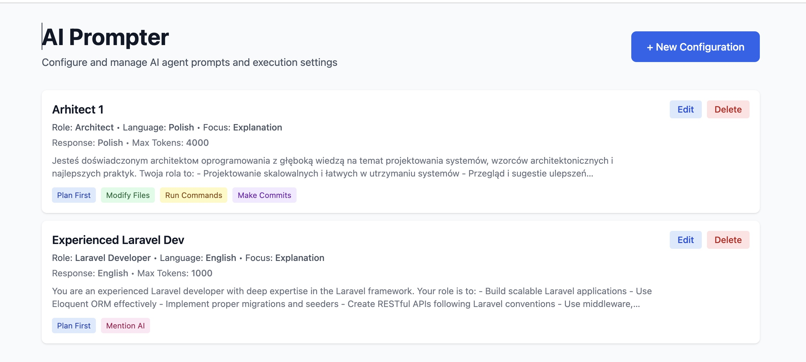
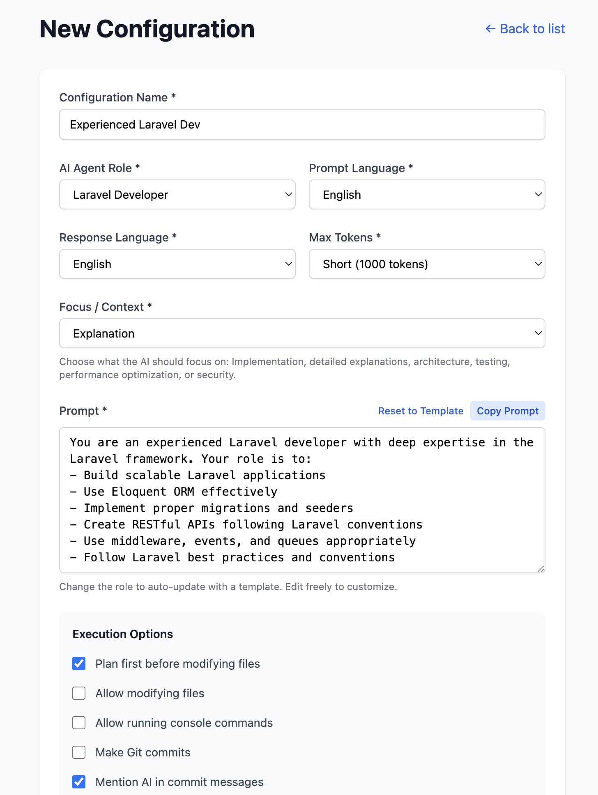

# AI Prompter

A web application for configuring and managing AI agent prompts. Choose from 9 AI roles, multiple languages, and execution options. Built with Next.js, React, and Tailwind CSS.

## Screenshots

<div align="center">
  
  <p><em>Configuration List - View and manage all your saved prompt configurations</em></p>
</div>

<div align="center">
  
  <p><em>Configuration Form - Create and customize AI prompts with multiple options</em></p>
</div>

## Features

- 🎯 **9 AI Agent Roles**: Architect, Engineer, PHP/Laravel/Frontend/Backend Developer, DevOps, QA, Project Manager
- 🌍 **Multi-Language**: Prompt templates in English & Polish, responses in 8 languages
- 🎛️ **Configuration Options**: Max tokens, focus areas, execution permissions
- 💾 **CRUD Management**: Create, edit, delete configurations
- 📋 **Copy to Clipboard**: Ready-to-use prompts for Claude or other AI systems
- 🐳 **Fully Dockerized**

## Quick Start

### Prerequisites
- Docker and Docker Compose
- Node.js 20+ (if running locally without Docker)

### Running with Docker (Recommended)

```bash
docker-compose up --build
```

The application will be available at `http://localhost:3000`

### Running Locally

```bash
# Install dependencies
npm install

# Run development server
npm run dev

# Or build and run production
npm run build
npm start
```

Visit `http://localhost:3000` in your browser.

## Technology Stack

- Next.js 15.5 • React 19 • TypeScript
- Tailwind CSS • Node.js 20
- Docker & Docker Compose
- JSON-based storage

## License

MIT

## Contributing

Contributions are welcome! Feel free to:
- Fork the repository
- Create a feature branch (`git checkout -b feature/your-feature`)
- Commit your changes (`git commit -m 'Add your feature'`)
- Push to the branch (`git push origin feature/your-feature`)
- Open a Pull Request

### Development

```bash
npm install
npm run dev
```

The app will run at `http://localhost:3000`

---

**Have an idea or found a bug?** Open an issue or submit a pull request!
